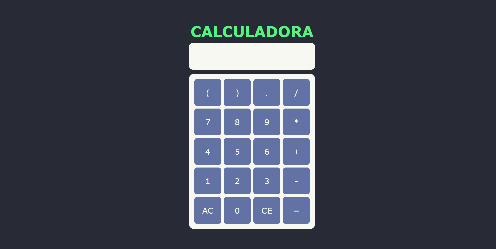

# 🧮 Calculadora em HTML, CSS e JavaScript

Uma calculadora simples e funcional desenvolvida com **HTML**, **CSS** e **JavaScript**.
Este projeto foi criado com foco em praticar manipulação do DOM, eventos e estruturação de layout usando CSS Grid.

---

## 🚀 Funcionalidades

* Operações básicas: **soma (+)**, **subtração (-)**, **multiplicação (*)** e **divisão (/)**
* Uso de **parênteses**
* Botões:

  * **AC** – Limpa toda a expressão
  * **CE** – Apaga o último caractere
  * **=** – Exibe o resultado
* Layout organizado com **CSS Grid**
* Visual moderno inspirado no tema *Dracula*

---

## 🛠 Tecnologias utilizadas

* **HTML5**
* **CSS3**
* **JavaScript (DOM + eventos)**

---

## 📸 Preview do projeto



---

## 📂 Estrutura do projeto

```
/
├── index.html
├── style.css
├── calculadora.js
└── assents/
    ├── preview.png
    └── icons/
        └── icon.png
```

---

## 🧩 Como funciona

A calculadora captura os cliques nos botões através de:

```js
const keys = document.querySelectorAll('.Key');
const display = document.querySelector(`input[type=text]`)
```

Os números são adicionados ao display, enquanto as funções **AC**, **CE** e **=** acionam funções específicas:

* `AllClear()` – limpa a expressão
* `CancelEntry()` – apaga o último caractere
* `ResultKey()` – avalia a expressão usando `eval()` e mostra o resultado

---

## ▶️ Como executar o projeto

1. Baixe ou clone o repositório:

   ```bash
   git clone https://github.com/Patrick-Kauai/Calculadora.git
   ```
2. Abra o arquivo **index.html** no navegador.
3. Pronto! Sua calculadora já está funcionando.
